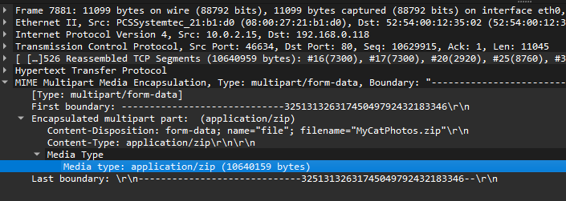

# Exercise 10-Bi Cats (non-scored) [0 points] (8 solves)
`file cats.cats` reveals that the `.cats` file is actually a `.pcapng` capture file, open the file in wireshark.\
In the packet No.7811, right-click the `media type` and choose `export packet bytes`. Name the exported file as a zip file.

Unzip the exported file by using `unzip file.zip`, and we see a bunch of cats photos and `Thumbs.db` file. `vinetto Thumbs.db -o a` will write the thumbnails to a selected dir, and we can see a qr-code inside the output folder. The QR-code is where the flag located.
