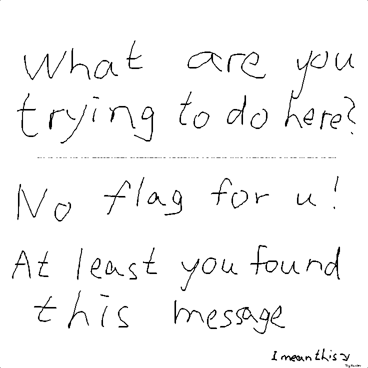

# Exercise 10-Bii PFP-as-a-Flag [100 points] (24 solves)
Submit the `pfp.png` to [Aperi'Solve](https://www.aperisolve.com/), and you may notice that there is a line in the middle of image:

Vertically stretch the line that make it a barcode, and scan it to get the flag.