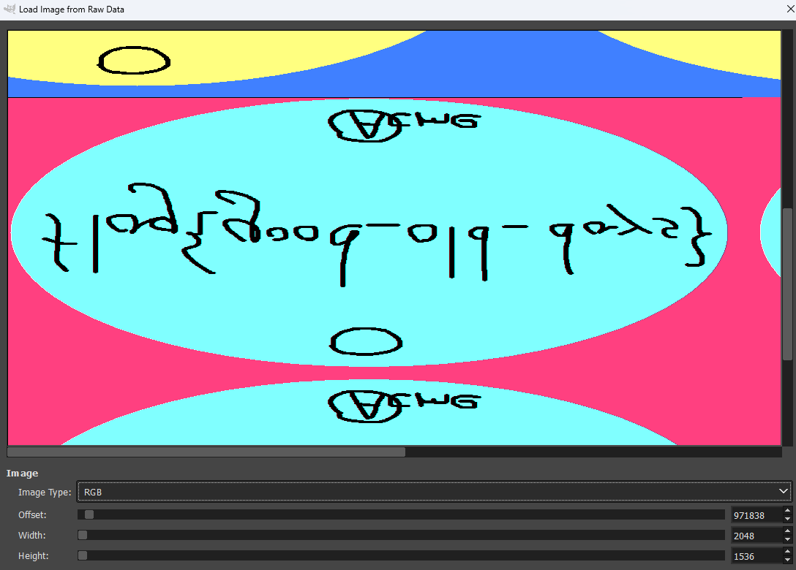

# Volatility [400 points] (2 solves)
As the challenge name stated, we will use [volatility](https://github.com/volatilityfoundation/volatility3) in this challenge. First, we may notice that the file name of the attached image is `flag-1024-768`. Play around with the vol command:
```bash
./vol.py -f memdump.bin windows.pstree.PsTree

PID     PPID    ImageFileName   Offset(V)       Threads Handles SessionId       Wow64   CreateTime      ExitTime        Audit   Cmd     Path
* 232   1504    mspaint.exe     0x81700020      5       126     0       False   2020-08-19 14:46:49.000000 UTC  N/A     \Device\HarddiskVolume1\WINDOWS\system32\mspaint.exe  "C:\WINDOWS\system32\mspaint.exe"  "C:\Documents and Settings\ACMEmployee\Desktop\flag-1024-768.bmp"     C:\WINDOWS\system32\mspaint.exe
```
Then, another tool [MemProcFS](https://github.com/ufrisk/MemProcFS) help us extract the whole file system: `./memprocfs -device memdump.bin -mount ~/memory -forensic 1`, but there is no `.bmp` file under the directory `C:\Documents and Settings\ACMEmployee\Desktop\`. Then, we may consider read the file from the buffer. Since the `PID` of the `mspaint.exe` is `232`:
```bash
./vol.py -f memdump.bin -o out windows.memmap --dump --pid 232
```
This will extract the dump file of `PID=232` to `pid.232.dmp`. From [this](https://w00tsec.blogspot.com/2015/02/extracting-raw-pictures-from-memory.html), GIMP will be a great tool to help us view the image from dump file:\
\
Flip the image vertically to get the flag.


reference list:
- https://hackmd.io/@TuX-/BymMpKd0s#Files
- https://fareedfauzi.github.io/2023/12/22/Windows-Forensics-checklist-cheatsheet.html
- https://medium.com/@chaoskist/cyberspacectf-2024-memory-forensic-challenge-35d1ea05ea33
- https://www.bizarrebinaries.com/blog/teamspy