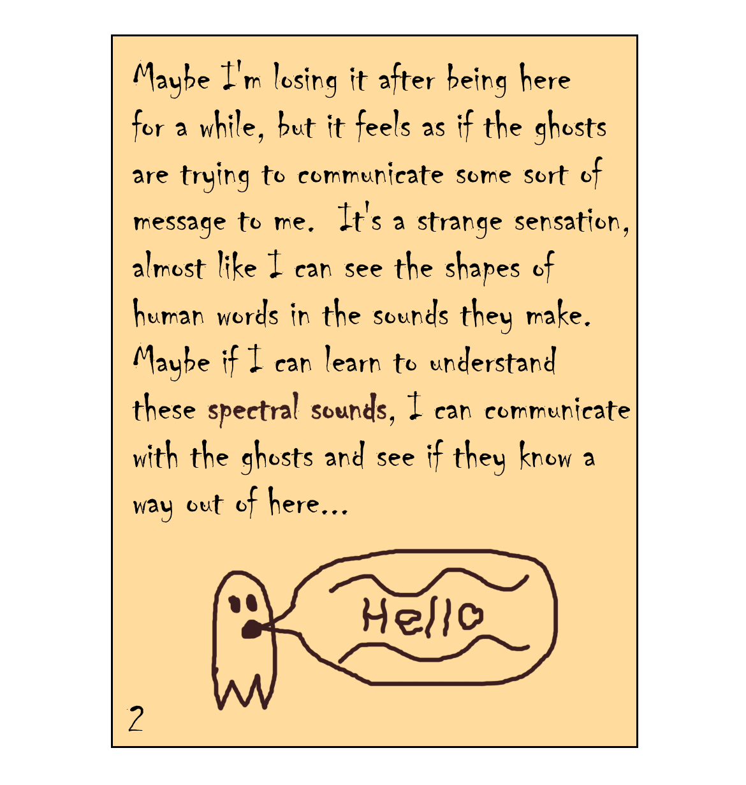

# Haunted Game [405 points] (47 solves) (Post-Match Solve)
This challenge consists of five notes that guide us through the solution. Let's analyze them one by one:
### Note 1
\
The key phrase `assets ripped` suggests our first step. Using `AssetRipper`, we need to extract both `Texture2D` and `AudioClip` from `sharedassets0.assets`. This tool reveals all the notes and necessary hints for solving the challenge.
### Note 2
\
The note mentions `spectral sounds` in relation to the ghosts, indicating we should examine `spectrograms`. After extracting the spirits' audio files and analyzing them in Audacity's spectrogram view, we discover that they contain fragments of the flag. However, these fragments alone aren't sufficient to recover the complete flag.
### Note 3
\
This note provides crucial information about the proper ordering of the spectrograms. The mention of `alpha` hints at using the alpha values from the spirits' textures to determine their visibility and thus their correct sequence.
### Note 4
\
The final useful note explains how to reconstruct the message from the spectrograms. I implemented this process in Python, as shown in [this script](Source_Code/source_to_flag.py). The resulting `res.wav` file, when viewed in Audacity's spectrogram mode, reveals the complete flag.

flag: `TUCTF{GHOST_IN_THE_MACHINE_02101981}`