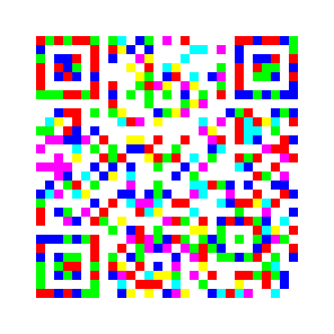

# QR Coded [277 points] (170 solves)
\
Get this from AperiSolve.

```python
import numpy as np
import cv2
img = cv2.imread("image_rgb_1.png")

white_mask = np.all(img >= 252, axis=2)

result = np.zeros_like(img)
result[white_mask] = [255, 255, 255]
cv2.imwrite('output_image.jpg', result)
```

flag: `bronco{th1s_0n3_i5}`