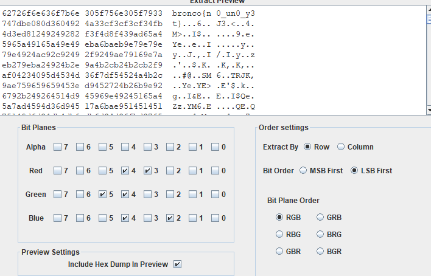

# Uno [496 points] (24 solves)
The given image shows some uno cards, it actually implies the LSB. `+2` for blue, `3` for red, `5` for green, and `+4` for all colours. Therefore, extract the LSB by using StegSolve: \

flag: `bronco{n0_un0_y3t}`