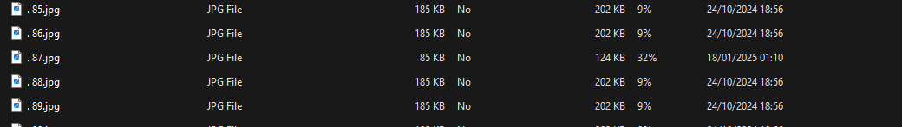

# Tabs&Spaces [100 points] (141 solves)
The python script is totally useless, you can easily find out the only suspicious by compare the file size:\
\
Then:
```bash
> stegseek 87.jpg

[i] Found passphrase: ""
[i] Original filename: "whitespace_flag.txt".
[i] Extracting to "87.jpg.out".
```
Although the extracted file appears to be blank, you can turn them into hex!
```python
enc_ = """ 	     	
 	    		
 	   	 	
 	    		
 	 	 	  
 	   		 
 				 		
 		 			 
  		    
 	 					
  		  		
 				   
 			    
  		   	
  		    
  		   	
  		 			
 	 					
 		 			 
  		    
 	 					
 		  			
  		 	  
  		   	
 		 			 
 					 	
"""
import re
enc_ = enc_.encode('utf-8').hex()

enc_ = re.sub("20","0",enc_)
enc_ = re.sub("09","1",enc_)
enc_ = re.sub("0a"," ",enc_)
flag = "".join([chr(int(i,2)) for i in enc_.split(" ") if i])
print(flag)
```

flag: `ACECTF{n0_3xp1017_n0_g41n}`