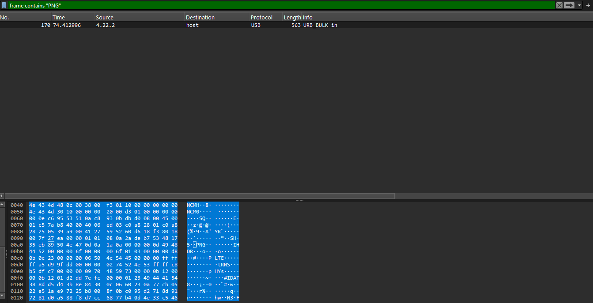

# USBnet [50 points] (191 solves)
\
You may notice this PNG header, extract the `.png` hex stream and render the image in cyberchef. It will end up with a QR-code.
```bash
$ tshark -r usbnet.pcapng -Y 'frame contains "PNG"' -T fields -e usb.capdata | grep -oP "8950.*"

89504e470d0a1a0a0000000d494844520000006f0000006f0103000000d80b0c2300000006504c5445000000ffffffa5d99fdd0000000274524e53ffffc8b5dfc7000000097048597300000b1200000b1201d2dd7efc0000012349444154388dd5d43b8e84300c0660230a77cb0522e51ae97225b8008f0bc095d2718d917281d0a588f8d7cc6877b40d4e33c546a1f890421c6387f067d0ff6022ea99865088acca03a5e7326433a182c15c0bd9f45cc5dec5b99a13e2964b15718534d23bc81bca7987ddc8fc3dfe0d659cde8cfe9dd81b264f53c696b1be3e75cbd3b5896d9223bb1a9a2e9b6ea79175268a472823c7d343a53cb2b0c9ed11ac4a59b2fa32042c3b7472e9f6385f2fad4aec56e6caedeca0f2c844f4e87ea252283f1d66c898192a114c93a983f97a665221e212248d65f43a131be276bb62834a19071e43b089754ac54a05ae2c456b555ebd00e90529ad0a4aff66c924357b15a5fc928f0beae8a80bd75e3ae5cea198a88c4ee7b37f5bc0ce04959fbb723fc56fd3d60e31e00c8f5e0000000049454e44ae426082
```

flag: `ENO{USB_ETHERNET_ADAPTER_ARE_COOL_N!C3}`