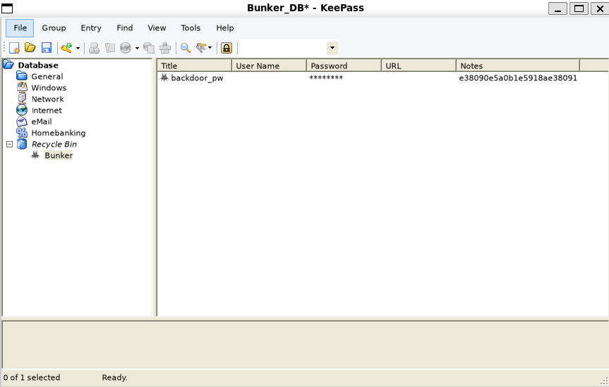
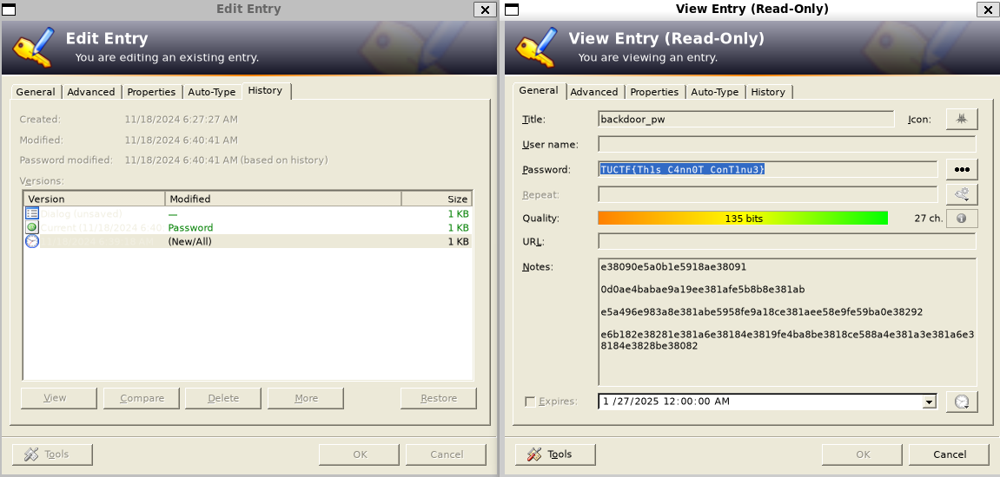

# Bunker [280 points] (66 solves) (Post-Match solve)
```bash
$ keepass2john Bunker_DB > hash.hash
```
[Keepass2john](https://github.com/ivanmrsulja/keepass2john) convert the keepass database to john format for password analysis.\
Then, [KeePass Memory Dump Extractor](https://github.com/JorianWoltjer/keepass-dump-extractor) is a great tool that help us extract all the potential key from the dump:
```bash
$ keepass-dump-extractor Bunker_DMP -f all > wl.txt
$ hashcat -m 13400 --username hash.hash wl.txt

Dictionary cache built:
* Filename..: wl.txt
* Passwords.: 475
* Bytes.....: 11400
* Keyspace..: 475
* Runtime...: 0 secs

$keepass$*2*60000*0*f963995b3319b040ec52881488a3bffa5383c97be0b8f2a436ad4cd7ab923d3c*3b50e2c3a128530f85ebfc1922341b7bfc108d90e89f7afe2d6357b7b7b71464*19a171e7b7cba00389be16fe6b5b91ac*3c0c7179c149fde32f773842a748f271745f1ea31b299af2a09d950f11ee4adc*7406554c88a9dfddb59cc6fee4c50af7c93b6cf6d6d9c50b84dd87db2669d571:gL0Ry_2_M4nk1Nd!_Y0RH4

Session..........: hashcat
Status...........: Cracked
Hash.Mode........: 13400 (KeePass 1 (AES/Twofish) and KeePass 2 (AES))
Hash.Target......: $keepass$*2*60000*0*f963995b3319b040ec52881488a3bff...69d571
Kernel.Feature...: Pure Kernel
Guess.Base.......: File (wl.txt)
Guess.Queue......: 1/1 (100.00%)
Speed.#1.........:      798 H/s (1.25ms) @ Accel:256 Loops:256 Thr:1 Vec:8
Recovered........: 1/1 (100.00%) Digests (total), 1/1 (100.00%) Digests (new)
Progress.........: 475/475 (100.00%)
Rejected.........: 0/475 (0.00%)
Restore.Point....: 0/475 (0.00%)
Restore.Sub.#1...: Salt:0 Amplifier:0-1 Iteration:59904-60000
Candidate.Engine.: Device Generator
Candidates.#1....:  L0Ry_2_M4nk1Nd!_Y0RH4 -> ~Ȁ0Ry_2_M4nk1Nd!_Y0RH4
```

This actually found out the masterkey is `gL0Ry_2_M4nk1Nd!_Y0RH4`, then with `keepass2 Bunker_DB -pw:'gL0Ry_2_M4nk1Nd!_Y0RH4'`, it automatically open the keepass app:\
\
There is something inside `Recycle Bin` called `backdoor_pw` which might hide the flag:\
\

flag: `TUCTF{Th1s_C4nn0T_ConT1nu3}`