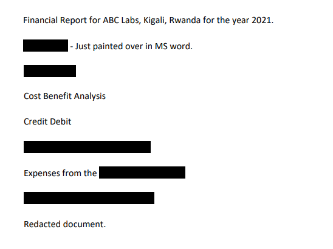

# Redaction gone wrong [Medium] (by Mubarak Mikail) - picoCTF 2022
> <p>Now you DON’T see me.</p>
<p>This <a href='https://artifacts.picoctf.net/c/84/Financial_Report_for_ABC_Labs.pdf' download>report</a> has some
critical data in it, some of which have been redacted correctly, while some
were not. Can you find an important key that was not redacted properly?</p>




Copy the text to somewhere else will get the flag:
```text
Financial Report for ABC Labs, Kigali, Rwanda for the year 2021.
Breakdown - Just painted over in MS word.

Cost Benefit Analysis
Credit Debit
This is not the flag, keep looking
Expenses from the
picoCTF{C4n_Y0u_S33_m3_fully}
Redacted document.
```

flag: `picoCTF{C4n_Y0u_S33_m3_fully}`